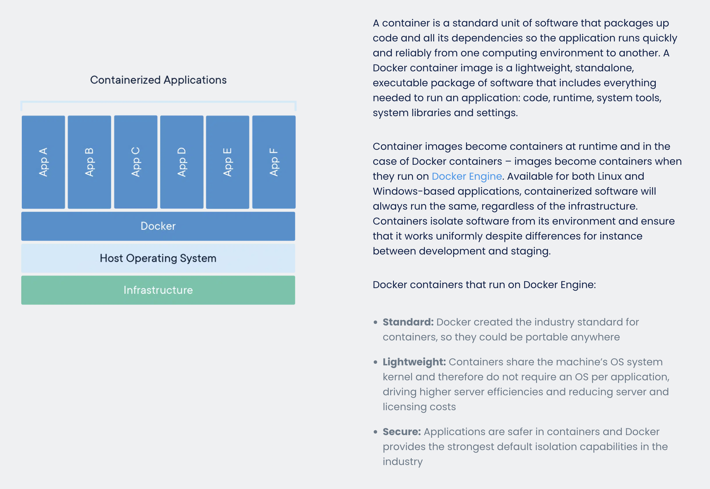

# 과제 목차
[1. 조용환](#조용환)
[2. 노세희](#노세희)
[3. 김영섭](#김영섭)
[4. 송윤재](#송윤재)
[5. 조에진](#조예진)
[6. 구본승](#구본승)


## 1. Commit Convention
 :clipboard: Form 
 
	> Type: [Subject] <- 변경 사항에 대한 짧은 요약
	> 
	> [Body] <- 무엇을, 왜 변경했는지 설명
	> 
	> [Footer] <- 이슈 트래커
	
:pushpin: Example

 	> Feat: "회원 가입 기능 구현"
	> 
	> 로그인에 필요한 회원 정보를 등록하기 위해 소셜 계정을 회원으로 등록 할 수 있게 함.
	> 
	> Resolved: #123
		Ref: #456
		Related to: #48, #45


### 1.1 태그 유형
|Tag            |Description					|
|---------------|-------------------------------|
|Feat 			|`새로운 기능을 추가하는 경우`     |
|Fix 			|`버그를 고친 경우`           	|
|Docs  			|`문서를 수정한 경우` 		    |
|Style 			|`코드 포맷 변경, 세미콜론 누락, 코드 수정이 없는 경우`	|
|Refactor 		|`코드 리펙토링`  			    |
|Test  			|`테스트 코드` 				    |
|Rename			|`파일명(or 폴더명)을 수정한 경우` |
|Remove 		|`코드(파일)의 삭제가 있을 때`     |
|Comment  		|`필요한 주석 추가 및 변경`    	|

### 1.2 이슈 트래커 유형
|Tag            |Description							|
|---------------|-------------------------------|
|Fixes 			|`이슈 수정 중(아직 해결되지 않은 경우)`     |
|Resolves 		|`이슈를 해결했을 때 사용`        	|
|Ref   			|`참고할 이슈가 있을 때 사용` 		    |
|Related to 	|`해당 커밋에 관련된 이슈번호 (아직 해결되지 않은 경우)`	|	


## 2. Git Flow
>   **feature > develop > release > hotfix > master**
-   위 순서들은 왼쪽으로 갈수록 포괄적인 가지이며 master branch를 병합할 경우 그 왼쪽에 있는 hotfix 등 모든 가지들에 있는 커밋들도 병합하도록 구성하게 된다.
-   5가지 중, **항시 유지되는 메인 브랜치 master, develop**  2가지와 **merge 되면 사라지는 보조 브랜치 feature, release, hotfix** 3가지로 구성된다.


|Branch            |Description							|
|---------------|-------------------------------|
|master  			|`라이브 서버에 제품으로 출시되는 브랜치`     |
|develop 		|`다음 출시 버전을 대비하여 개발하는 브랜치`        	|
|feature   			|`추가 기능 개발 브랜치. develop 브랜치에 들어간다` 		    |
|release 	|`다음 버전 출시를 준비하는 브랜치. develop 브랜치를 release 브랜치로 옮긴 후 QA, 테스트를 진행하고 master 브랜치로 합친다`	|	
|hotfix    			|`master 브랜치에서 발생한 버그를 수정하는 브랜치` 		    |


---------------------------------------------------------------
## 조용환

## react-calendar

앞으로 있을 미래 여행 계획을 확인하고, 일정 짜는 것에 도움이 되기 위한 캘린더가 필요해 해당 라이브러리를 사용.

ex)

```jsx
import Calendar from "react-calendar";

export default function CalendarCp() {

return (
    <div>
      <h1>{`현재 표시된 날짜 : ${moment(value).format("YYYY-MM-DD")}`}</h1>
      <Calendar
        calendarType="gregory"
        onChange={setValue}
        value={value}
        minDate={new Date(2024, 0, 1)}
        tileContent={addContent}
        onClickDay={onClickDayHandler}
      />
    </div>
  );
}
```

calendarType : 주의 시작을 어느 요일로 할지

onChange : 값 변화 연동 함수

value : onChange와 세트로 사용. useState의 value, setValue와 같은 관계

minDate : 설정할 수 있는 최소 날짜

titleContent : 캘린더 내부(날짜)아래에 넣을 수 있는 컨텐츠

onClickDay : 날짜 클릭시 실행되는 함수 설정

- 비슷하게 쓸 수 있는 라이브러리
    - react-big-calendar : 캘린더 자체가 메인 기능은 아니었기에 사용  x
    - react-datepicker : 항상 캘린더를 띄워놔야했기에 다른 옵션을 사용.

## react-multi-carousel

carousel 인데 2x2 등의 멀티 아이템을 구현하기 위해 사용한 라이브러리, 자체 구현의 경우 div 속에 div를 넣으면서 img 가 깨지는 현상이 심하게 일어나 사용하게 된 라이브러리.

react-responsive-carousel같은 경우는 사용할 수 있는 옵션은 비슷하게 많지만, example 코드가 빈약해 적용이 힘들어 react-mulit-carousel을 사용하게 되었다. 이를 이용해 infinite loop, autoplay, 그리고 3x2, 2x2 등 그리드 개념의 캐러셀을 움직이도록 만들 수 있게 되었다.

```jsx
import Carousel from "react-multi-carousel";
import "react-multi-carousel/lib/styles.css";

const responsive = {
  desktop: {
    breakpoint: { max: 3000, min: 1024 },
    items: 3,
    slidesToSlide: 3 // optional, default to 1.
  },
  tablet: {
    breakpoint: { max: 1024, min: 464 },
    items: 2,
    slidesToSlide: 2 // optional, default to 1.
  },
  mobile: {
    breakpoint: { max: 464, min: 0 },
    items: 1,
    slidesToSlide: 1 // optional, default to 1.
  }
};
<Carousel
  swipeable={false}
  draggable={false}
  showDots={true}
  responsive={responsive}
  ssr={true} // means to render carousel on server-side.
  infinite={true}
  autoPlay={this.props.deviceType !== "mobile" ? true : false}
  autoPlaySpeed={1000}
  keyBoardControl={true}
  customTransition="all .5"
  transitionDuration={500}
  containerClass="carousel-container"
  removeArrowOnDeviceType={["tablet", "mobile"]}
  deviceType={this.props.deviceType}
  dotListClass="custom-dot-list-style"
  itemClass="carousel-item-padding-40-px"
>
  <div>Item 1</div>
  <div>Item 2</div>
  <div>Item 3</div>
  <div>Item 4</div>
</Carousel>;
```

swipable : 탭, 드래그로 슬라이드 변경 가능 여부

draggable: 마우스 드래그 슬라이드 변경 여부

showDots: 하단 도트 표시 여부

responsive : 반응형 디자인을 위한 설정

ssr: ssr 사용여부

infinite : 무한 루프 사용 여부

autoPlay : 자동재생 활성화 여부

autoPlaySpeed: 키브도 컨트롤 허용 여부

customTransition : “transitionProperty transitionDuration [transitionTimingFunction] [transitionDelay]” 로 이루어짐. ex) customTransition=”all 0.5s ease-in-out 0s”

transitionDuration : 트랜지션의 지속 시간 밀리초 단위 지정

containerClass: 컨테이너 적용 사용자 지정 클래스 

removeArrowOnDeviceType : 특정 디바이스 유형에서 화살표 숨길지 여부 

deviceType: 현재 사용 중인 디바이스 유형

dotListClass : 도트 리스트 적용되는 사용자 지정 클래스 지정

itemClass : 각 슬라이드 아이템에 적용되는 사용자 지정 클래스를 지정합니다.

## react-spinners

사용자 경험을 좋게 만들기 위해 로딩 스피너의 필요성을 느꼈고, 다양한 로딩 스피너 라이브러리 중 하나인 react-spinners를 사용했다. react로 개발했기에 react에서 사용하기 편한 라이브러리가 필요해서 사용하게 되었다

ex)

```jsx
import ClipLoader from "react-spinners/ClipLoader";

export default function LoadingSpinner () {
	return <ClipLoader color="d3d3d3" />
}
```

## 노세희

## Google Map API

### 구글 맵 키 발급후, @react-google-maps/api 설치

---

- `.env` 파일에 API_KEY 설정

`VITE_APP_GOOGLEMAP_API_KEY={발급받은 키 입력}`

- 라이브러리 설치

`npm install @react-google-maps/api`

### 기본 지도 띄우기 : GoogleMap.jsx
 
 
---

- `React.memo`를 이용하여 변경시에만 작동하도록 설정
- `containerStyle` : 지도 컨테이너 크기
- `center` :  지도 로드 시 처음으로 띄울 지역의 위도, 경도 지정
- `zoom` : **확대/축소 수준(1:세계, 5:대륙, 10:도시, 15:거리, 20:건물)**

```jsx
import React, { Fragment } from 'react'
import { GoogleMap, useJsApiLoader } from '@react-google-maps/api';

const containerStyle = {
  width: '1200px',
  height: '650px'
};

const center = {
  lat: 37.5012647456244,
  lng: 127.03958123605
};

const options = {
  minZoom : 4,
  maxZoom: 18,
}

function MyComponent() {

	// 지도를 불러오는 함수
  // useJsApiLoader 함수는 isLoaded, loadError를 return
  const { isLoaded } = useJsApiLoader({
    id: 'google-map-script',
		// google maps 에서 받은 api key를 전달
    googleMapsApiKey : import.meta.env.VITE_GOOGLEMAP_API_KEY,
  })

  const [map, setMap] = React.useState(null)

	// 지도를 그릴때 동작하는 함수
  // google map의 instance를 사용가능
  const onLoad = React.useCallback(function callback(map) {
    const bounds = new window.google.maps.LatLngBounds(center);
    map.fitBounds(bounds);

    setMap(map)
  }, [])

	// 지도 컴포넌트가 언마운트 되기 전에 해야하는 동작
  const onUnmount = React.useCallback(function callback(map) {
    setMap(null)
  }, [])

  return isLoaded ? (
    <Fragment>
      <h1>Google Map</h1>
      <hr />
      <GoogleMap
        mapContainerStyle={containerStyle}
        center={center}
        onLoad={onLoad}
        onUnmount={onUnmount}
        options={options}
      >
      </GoogleMap>
    </Fragment>
  ) : null
}

export default React.memo(MyComponent)
```

### 지도 커스텀하기

---

- 기본 UI 지우기

`options = disableDefaultUI: true`

- 기본 마커 지우기

```jsx
const myStyles = [
  {
    featureType: "poi",
    elementType: "labels",
    stylers: [{ visibility: "off" }],
  },
];
```

`options = style: myStyles`

- 마커 추가하기

```jsx
<MarkerF position={center} />

// 👉 position (필수옵션!) = 마커의 위치
// 👉 custom Marker사용시 마커 추가 선택옵션
// map = 마커를 배치할 Map을 지정   ex) map={myMap1}
//       마커의 setMap() 메서드를 호출하여 마커 추가 및 삭제 가능.
// title = 마커의 설명   ex) title:"Hello World!"
// icon, path, scale, anchor, rotaion, fillColor 등등..
```

- 다중 마커 띄우기(더미데이터)

```jsx
const [locations, setLocations] = useState([
    { name:'명동', lat: 37.563576, lng:126.983431},
    { name:'가로수길', lat:37.520300, lng:127.023008},
    { name:'광화문', lat:37.575268, lng:126.976896},
    { name:'남산', lat:37.550925, lng:126.990945},
    { name:'이태원', lat:37.540223, lng:126.994005} 
  ]);

<GoogleMap>
...
{locations.map((location, index) => (
    <MarkerF
      key={index}
      label={String(index + 1)}  
      position={{ lat: location.lat, lng: location.lng }}
    />
 ))}
...
</GoogleMap>
```

### 장소 검색 기능 추가

---

```jsx
import React, { useCallback, useRef, useEffect, useState } from "react";

const SearchBox = ({ map, onPlaceSelected }) => {

  const input = useRef(null);
  const searchBox = useRef(null);
  const [selectedPlaces, setSelectedPlaces] = useState([]);

	// 검색 상자에서 장소가 변경될 때 호출되는 함수
	// 선택된 장소의 좌표를 추출, 상태를 업데이트, onPlaceSelected 콜백을 호출
  const handleOnPlacesChanged = useCallback(() => {
    const places = searchBox.current.getPlaces();

    if (places.length > 0) {
      const selectedPlace = places[0];
      const lat = selectedPlace.geometry.location.lat();
      const lng = selectedPlace.geometry.location.lng();

      setSelectedPlaces((prevPlaces) => [...prevPlaces, { lat, lng }]);
      onPlaceSelected({ lat, lng });
    }
    if (input.current) {
      input.current.value = "";
    }
  }, [onPlaceSelected]);

  useEffect(() => {
    if (map) {
      searchBox.current = new window.google.maps.places.SearchBox(input.current);
      searchBox.current.addListener("places_changed", handleOnPlacesChanged);
    }

    return () => {
      if (map) {
        searchBox.current = null;
        window.google.maps.event.clearInstanceListeners(searchBox);
      }
    };
  }, [map, handleOnPlacesChanged]);

  return <input ref={input} placeholder="장소를 검색해주세요" type="text" />;
};

export default SearchBox;
```

### 검색한 장소 새로운 배열에 저장, 새로운 마커 추가

---

```jsx
const handlePlaceSelected = useCallback((place) => {
    const newMarkers = [...markers, { position: place, label: String(markers.length + 1) }];
    setMarkers(newMarkers);

  }, [markers]);

<SearchBox map={map} onPlaceSelected={handlePlaceSelected} />
<GoogleMap>
...
{markers.map((marker, index) => (
          <MarkerF
            key={index}
            label={marker.label}
            position={marker.position}
          />
 ))}
<GoogleMap />
```

### center과의 거리에 따라 마커들을 정렬

---

```jsx
// 두 장소간의 거리 계산 
// Haversine 공식 -> 지구 표면에서의 두 지점 간 직선거리 계산
const calculateDistance = (p1, p2) => {
  const R = 6378137; // 지구의 평균 반지름 (미터)
  const dLat = (p2.lat - p1.lat) * (Math.PI / 180);
  const dLong = (p2.lng - p1.lng) * (Math.PI / 180);
  const a =
    Math.sin(dLat / 2) * Math.sin(dLat / 2) +
    Math.cos((p1.lat * Math.PI) / 180) * Math.cos((p2.lat * Math.PI) / 180) * Math.sin(dLong / 2) * Math.sin(dLong / 2);
  const c = 2 * Math.atan2(Math.sqrt(a), Math.sqrt(1 - a));
  const d = R * c;
  return d; // 거리를 미터 단위로 반환
};

console.log("Sorted Markers:", sortedMarkers);

// 거리를 계산한 마커들을 정렬해서 저장
const sortedMarkers = markers
  .map((marker) => ({ ...marker, distance: calculateDistance(center, marker.position) }))
  .sort((a, b) => a.distance - b.distance);
```

### Directions API 경로, 거리, 시간

---

```jsx
import React, { useState, useEffect, useRef, Fragment } from "react";
import { DirectionsRenderer, DirectionsService } from "@react-google-maps/api";

const Directions = ({ origin, destination }) => {
  const [directions, setDirections] = useState();
  const count = useRef(0);

  const dirOptions = {
    // 경로선 색, 두께, 투명도
    polylineOptions: {
      strokeColor: "red",
      strokeWeight: 6,
      strokeOpacity: 0.5,
    },
    // 기본마커 제거
    suppressMarkers: true,
  };

  useEffect(() => {
    count.current = 0;
    // console.log(origin, destination);
  }, [origin, destination]);

  const directionsCallback = (result, status) => {
    // console.log(result, status);
    // 동일한 방향에 대해 여러 번의 콜백이 발생하는 경우에도 첫 번째 호출만 고려
    if (status === "OK" && count.current === 0) {
      console.log("출발 : " + result.routes[0].legs[0].start_address);
      console.log("도착 : " + result.routes[0].legs[0].end_address);
      console.log("거리 : " + result.routes[0].legs[0].duration.text);
      console.log("시간 : " + result.routes[0].legs[0].distance.text);
      count.current += 1;
      setDirections(result);
    }
  };

  useEffect(() => {
   // console.log("Directions updated:", setDirections);
  }, [setDirections]);

  return (
    <Fragment>
      <DirectionsService
        options={{ origin, destination, travelMode: "TRANSIT",}}
        callback={directionsCallback}
      />
      <DirectionsRenderer directions={directions} options={dirOptions} />
   </Fragment>
  );
};

export default Directions;
```

```jsx
{markers.length >= 2 && (
          <Fragment>
            {sortedMarkers.slice(0, -1).map((marker, index) => (
              <Directions
                key={index}
                origin={sortedMarkers[index].position}
                destination={sortedMarkers[index + 1].position}
              />
             ))}
         </Fragment>
)}

-> 마커가 2개 이상되면, 경로를 표시하도록!
```

### 🧨 중간 결과

---

**용산공원 → 신용산역 → 남산공원 → 여의도한강공원 경로**


### 추가 고려사항

---

```jsx
1. 지금은 지도 처음 띄울 때 설정하는 center를 기준으로 거리를 계산해서 마커를 찍는데 추후에 가능하다면
	최적경로까진 못하더라도 출발지 고정해서 출발지에서 가까운 장소부터 가는 경로를 ? 뭐가 좋을지 고민!
2. 한국은 DRIVING 옵션이 적용 안되는 것 같고, 해외로 바꿔서 DRIVING, TRANSIT 선택 가능한 지 확인
3. Directions.jsx에서 console에 출력한 거리, 시간을 상태관리 이용해서 화면에 출력 ? DB 저장 ?
4. Directions API에서 제공하는 기본 아이콘, 설명 등 커스텀 가능한 옵션 
```

### 장소 검색 및  세부 정보

---

**getDetails()호출이 성공하면 반환되는 속성**

```
//장소를 고유하게 나타내는 텍스트 식별자
place_id -> 장소 세부정보 요청에 전달에서 정보 가져올 수 있음

// 장소의 이름
name

// 장소가 비즈니스인 경우 장소의 영업상태를 나타냄
business_status : OPERATIONAL,  CLOSED_TEMPORARILY ,  CLOSED_PERMANENTLY

// 장소의 사람이 읽을 수 있는 주소 (대개 우편 주소와 일치)
formatted_address

// 장소의 도형 관련 정보
geometry : location(위도, 경도 제공)

// 이 장소의 유형을 나타내는데 사용할 수 있는 이미지 리소스의 URL
icon

// 장소의 영업 기간
opening_hours -> periods[] : 일요일부터 7일 동안의 영업기간을 시간순으로 나타내는 배열
              -> weekday_text : 각 요일의 형식이 지정된 영업시간을 나타내는 일곱 개의 문자열 배열

// 집계된 사용자 리뷰를  기준으로 한 장소 평점(0.0~5.0)
rating

// PlacePhtoh 객체의 배열 getUrl()메서드로 사진 가져올 수 있음
photos[] -> height(최대 높이), width(최대 너비) 지정 가능
```

## HTTP 요청 도구

서버와 데이터를 주고받기 위해서는 HTTP 통신을 해야 함

React에는 HTTP Client(HTTP 상에서 커뮤니케이션을 하는 자바 기반 컴포넌트) 내장 클래스가 존재하지 않음

따라서 React에서 AJAX(Asynchronous Javascript And XML)를 구현하려면 JavaScript 내장객체인 XMLRequest를 사용하거나, 다른 HTTP Client를 사용

`AJAX : 서버와 통신하기 위해 XMLHttpRequest 객체를 사용하는 것으로, JSON, XML, HTML 그리고 일반 텍스트 형식 등을 포함한 다양한 포맷을 비동기로 주고받을 수 있다.`

HTTP Client 라이브러리에는 **Fetch API, Axios**가 있는데, 사용하는 형태에 약간 차이가 있음!

## 💥 Axios

- **GET**: 데이터 조회, **POST**: 데이터 등록, **PUT**: 데이터 수정, **DELETE**: 데이터 제거
- 비동기로 서버에 요청, 응답이 오면 받아서 성공/실패 시를 구분해서 처리
- 서버 요청 후 응답이 오기까지 시간이 걸리기 때문에 요청은 비동기 처리
    
    응답을 처리하는 부분은 `then` 이나 `await`  사용
    
- 더 편리한 API 기능을 제공, **프로미스 기반으로 비동기 작업을 처리하는데 있어서 직관적**
- 웹 브라우저 호환성, 보완성이 높음 → 보안성, 장기성, 큰 프로젝트를 사용하기 위해서 추천

### **1. Axios 설치**

`npm install axios`

### **2. Axios 사용하기**

### ✅ useState와 useEffect로 데이터 로딩하기

- useState를 사용하여 요청 상태를 관리, useEffect를 사용하여 컴포넌트가 렌더링되는 시점에 요청을 시작

```jsx
// 상태 관리는 (요청의 결과, 로딩상태, 에러) 3가지 상태를 관리!

import React, { useState, useEffect } from 'react';
import axios from 'axios';

function Users() {
  const [users, setUsers] = useState(null);
  const [loading, setLoading] = useState(false);
  const [error, setError] = useState(null);

  const fetchUsers = async () => {
    try {
      // 요청이 시작 할 때에는 error 와 users 를 초기화하고
      setError(null);
      setUsers(null);
      // loading 상태를 true 로 바꿉니다.
      setLoading(true);
      const response = await axios.get(
        'https://jsonplaceholder.typicode.com/users'
      );
      setUsers(response.data); // 데이터는 response.data 안에 
    } catch (e) {
      setError(e);
    }
    setLoading(false);
  };

  useEffect(() => {
    fetchUsers();
  }, []);

  if (loading) return <div>로딩중..</div>;
  if (error) return <div>에러가 발생했습니다</div>;
  if (!users) return null;
  return (
    <>
      <ul>
        {users.map(user => (
          <li key={user.id}>
            {user.username} ({user.name})
          </li>
        ))}
      </ul>
      <button onClick={fetchUsers}>다시 불러오기</button>
    </>
  );
}

export default Users;
```

### ✅ useReducer로 요청 상태 관리하기

- `useState`의 setState 함수를 여러 번 사용하지 않아도 되고, 리듀서로 로직 분리했으니 재사용성 증가!!

```jsx
import React, { useEffect, useReducer } from 'react';
import axios from 'axios';

function reducer(state, action) {
  switch (action.type) {
    case 'LOADING':
      return {
        loading: true,
        data: null,
        error: null
      };
    case 'SUCCESS':
      return {
        loading: false,
        data: action.data,
        error: null
      };
    case 'ERROR':
      return {
        loading: false,
        data: null,
        error: action.error
      };
    default:
      throw new Error(`Unhandled action type: ${action.type}`);
  }
}

function Users() {
  const [state, dispatch] = useReducer(reducer, {
    loading: false,
    data: null,
    error: null
  });

  const fetchUsers = async () => {
    dispatch({ type: 'LOADING' });
    try {
      const response = await axios.get(
        'https://jsonplaceholder.typicode.com/users'
      );
      dispatch({ type: 'SUCCESS', data: response.data });
    } catch (e) {
      dispatch({ type: 'ERROR', error: e });
    }
  };

  useEffect(() => {
    fetchUsers();
  }, []);

  const { loading, data: users, error } = state; // state.data 를 users 키워드로 조회

  if (loading) return <div>로딩중..</div>;
  if (error) return <div>에러가 발생했습니다</div>;
  if (!users) return null;
  return (
    <>
      <ul>
        {users.map(user => (
          <li key={user.id}>
            {user.username} ({user.name})
          </li>
        ))}
      </ul>
      <button onClick={fetchUsers}>다시 불러오기</button>
    </>
  );
}

export default Users;
```

### ✅ **useAsync 커스텀 Hook 만들어서 사용**

- 데이터를 요청할 때마다 리듀서를 작성하는 것은 번거로운 일 → 쉽게 재사용
- 첫번째 파라미터 `API 요청을 시작하는 함수`, 두번째 파라미터 `deps`

```jsx
// uesAsync.js
import { useReducer, useEffect } from 'react';

function reducer(state, action) {
  switch (action.type) {
    case 'LOADING':
      return {
        loading: true,
        data: null,
        error: null
      };
    case 'SUCCESS':
      return {
        loading: false,
        data: action.data,
        error: null
      };
    case 'ERROR':
      return {
        loading: false,
        data: null,
        error: action.error
      };
    default:
      throw new Error(`Unhandled action type: ${action.type}`);
  }
}

function useAsync(callback, deps = []) {
  const [state, dispatch] = useReducer(reducer, {
    loading: false,
    data: null,
    error: false
  });

  const fetchData = async () => {
    dispatch({ type: 'LOADING' });
    try {
      const data = await callback();
      dispatch({ type: 'SUCCESS', data });
    } catch (e) {
      dispatch({ type: 'ERROR', error: e });
    }
  };

  useEffect(() => {
    fetchData();
    // eslint 설정을 다음 줄에서만 비활성화
    // eslint-disable-next-line
  }, deps);

  return [state, fetchData];
}

export default useAsync;

// user.js
import React from 'react';
import axios from 'axios';
import useAsync from './useAsync';

// useAsync 에서는 Promise 의 결과를 바로 data 에 담기 때문에,
// 요청을 한 이후 response 에서 data 추출하여 반환하는 함수를 따로 생성
async function getUsers() {
  const response = await axios.get(
    'https://jsonplaceholder.typicode.com/users'
  );
  return response.data;
}

function Users() {
  const [state, refetch] = useAsync(getUsers, []);

  const { loading, data: users, error } = state; // state.data 를 users 키워드로 조회

  if (loading) return <div>로딩중..</div>;
  if (error) return <div>에러가 발생했습니다</div>;
  if (!users) return null;
  return (
    <>
      <ul>
        {users.map(user => (
          <li key={user.id}>
            {user.username} ({user.name})
          </li>
        ))}
      </ul>
      <button onClick={refetch}>다시 불러오기</button>
    </>
  );
}

export default Users;
```

### ✅ API에 파라미터가 필요한 경우

```jsx
// user.js
import React from 'react';
import axios from 'axios';
import useAsync from './useAsync';

async function getUser(id) {
  const response = await axios.get(
    `https://jsonplaceholder.typicode.com/users/${id}`
  );
  return response.data;
}

function User({ id }) {
  const [state] = useAsync(() => getUser(id), [id]);
  const { loading, data: user, error } = state;

  if (loading) return <div>로딩중..</div>;
  if (error) return <div>에러가 발생했습니다</div>;
  if (!user) return null;

  return (
    <div>
      <h2>{user.username}</h2>
      <p>
        <b>Email:</b> {user.email}
      </p>
    </div>
  );
}

export default User;

// Users.js
import React, { useState } from 'react';
import axios from 'axios';
import useAsync from './useAsync';
import User from './User';

// useAsync 에서는 Promise 의 결과를 바로 data 에 담기 때문에,
// 요청을 한 이후 response 에서 data 추출하여 반환하는 함수를 따로 생성
async function getUsers() {
  const response = await axios.get(
    'https://jsonplaceholder.typicode.com/users'
  );
  return response.data;
}

function Users() {
  const [userId, setUserId] = useState(null);
  const [state, refetch] = useAsync(getUsers, [], true);

  const { loading, data: users, error } = state; // state.data 를 users 키워드로 조회

  if (loading) return <div>로딩중..</div>;
  if (error) return <div>에러가 발생했습니다</div>;
  if (!users) return <button onClick={refetch}>불러오기</button>;
  return (
    <>
      <ul>
        {users.map(user => (
          <li
            key={user.id}
            onClick={() => setUserId(user.id)}
            style={{ cursor: 'pointer' }}
          >
            {user.username} ({user.name})
          </li>
        ))}
      </ul>
      <button onClick={refetch}>다시 불러오기</button>
      {userId && <User id={userId} />}
    </>
  );
}

export default Users;
```

## 💥 Fetch API

### 장점

- 자바스크립트의 내장 라이브러리 이므로 별도로 import 할 필요가 없음
- `Promise` 기반으로 만들어졌기 때문에 데이터를 다루기 편리
- 내장 라이브러리이기 때문에 업데이트에 따른 에러 방지가 가능

### 단점

- 지원하지 않는 브라우저가 존재 (IE11...)
- 네트워크 에러 발생 시 response timeout이 없어 기다려야 함
- JSON으로 변환해주는 과정 필요
- 상대적으로 axios에 비해 기능이 부족

```jsx
const url ='<http://localhost3000/test`>
const option ={
   method:'POST',
   header:{
     'Accept':'application/json',
     'Content-Type':'application/json';charset=UTP-8'
  },
  body:JSON.stringify({ // body 부분에 stringify()
  	name:'name',
    age:20
  })

  fetch(url, options) // url이 인자로 들어감
  	.then(response => console.log(response))
    ```


## 리덕스 미들웨어

- 리액션이 디스패치 된 다음, 리듀서에 해당 액션을 받아와서 업데이트 하기 전에 추가적인 작업 가능

- 보통, 비동기 작업(백엔드 API를 연동해야 된다면)처리 할 때, 미들웨어 사용해서 처리
- 비동기 작업에 관련된 미들웨어 라이브러리
    
     [redux-thunk](https://github.com/reduxjs/redux-thunk), [redux-saga](https://github.com/redux-saga/redux-saga), [redux-observable](https://redux-observable.js.org/), [redux-promise-middleware](https://www.npmjs.com/package/redux-promise-middleware) 
    

## redux-thunk

`npm install redux-thunk`
- 비동기 작업을 처리할 때 가장 많이 사용하는 미들웨어
- 액션 객체가 아닌 함수를 디스패치 할 수 있음!

### **redux-thunk로 프로미스 다루기**

- `Promise 객체` 비동기 작업이 맞이할 미래의 완료 또는 실패와 그 결과 값
- 대기(*pending)*: 이행하지도, 거부하지도 않은 초기 상태.
- 이행(*fulfilled)*: 연산이 성공적으로 완료됨.
- 거부(*rejected)*: 연산이 실패함.


## 김영섭

## 인프라 사용 가이드
### 자주 쓸 명령어 
#### Q&A
- Q. 프론트 빌드 배포했는데 서버 갑자기 터짐
- A. 네트워크 재설정 되서 그런거임 Nginx restart 해주세요.
- Q. ```docker ps -a``` 찍어봤는데 무한 restarting 함 
- A. 일단 ```docker stop``` 하고 방금 건드린 파일 cp 해와서 기존 상태로 고치고 다시 cp 해서 원복시키세요.
- Q. 포트 맞게 연결한 것 같은데 안되뮤ㅠㅠㅠ
- A. 도커 간 네트워크 연결해놨으면 ```내부 Port```로 접속하면 됩니다.

#### EC2 Shell 관련 
1. 컨테이너 목록 조회
    - ``` docker ps -a ```
2. 컨테이너 상세 조회
    - ``` docker inspect $'container-name' ```
3. 네트워크 목록 조회
    - ``` docker network ls ```
4. 네트워크 상세 조회
    - ``` docker network $'network-name' ```
5. 도커 컨테이너 진입
    - ``` docker exec -it $'container-name' /bin/bash```
6. 도커 내부 파일 복사
    - ``` docker cp $'from-location' $'to-location' ```
7. 해당 문자열 포함하는 컨테이너 행 모두 rm
    - ```docker ps -a | grep $'word' | awk '{print $1}' | xargs docker rm```
8. 도커 컨테이너 네트워크 연결
    - ```docker network connect $'network-name' $'container-name'```
9. 열린 포트 확인
    - ```netstat -nltp```
10. 내가 친 Command 확인 
    - ```history``` 

## 인프라 구축 가이드
### EC2 Key 로 MobaXterm 연동
- Session 추가해서 epm 키 연동. 이후 ubuntu 서버 접속 가능.
- 서버 시간을 한국 표준시로 변경할 것 (기본은 UTC+0)
    - ```sudo timedatectl set-timezone Asia/Seoul```
- 미러 서버를 카카오 서버로 변경
    - 카카오에서 제공하는 미러 서버
    - ```sudo sed -i 's/ap-northeast-2.ec2.archive.ubuntu.com/mirror.kakao.com/g' /etc/apt/sources.list```
- 미러 서버 변경 후 패키지 ```UPDATE```
    - ```sudo apt-get -y update && sudo apt-get -y upgrade```
- Swap 영역 할당 
    - Swap 영역 : 메모리 부족 시를 대비하여 디스크의 일부 공간을 비상용으로 할당.
    - 당연히 성능은 메모리 쓰는 것보다는 느리겠지만 비상용 할당임
    - 용량 확인, 영역 할당, 권한 설정, swapfile 생성, 활성화, 유지 설정
    ```console
    free -h 
    sudo fallocate -l 4G /swapfile
    sudo chmod 600 /swapfile
    sudo mkswap /swapfile
    sudo swapon /swapfile
    sudo echo '/swapfile none swap sw 0 0' | sudo tee -a /etc/fstab
    ```
### Docker 설치
#### 필요한 Package 설치
#### Docker Compose
- 여러 컨테이너 구동 시, 초기 run을 더 간편하게 하기 위해 작성한 일종의 스크립트
- 컨테이너 생성, 환경 변수 설정, 네트워크 설정, 컨테이너 생성 순서와 의존성 설정 등 가능
- ~~매번 새로 하면 헷갈리고 힘들어~~
- 도커 컴포즈 다운로드
    ```
    sudo curl -L "https://github.com/docker/compose/releases/download/v2.21.0/docker-compose-$(uname -s)-$(uname -m)" -o /usr/local/bin/docker-compose
    ```
- 도커 컴포즈 디렉토리 사용 권한 변경
    ```
    sudo chmod +x /usr/local/bin/docker-compose
    ```
### Jenkins 설치
#### Jenkins 도커 컨테이너 생성
```
docker run -d --restart always --env JENKINS_OPTS=--httpPort=8080 --env JENKINS_OPTS="--prefix=/jenkins" -v /etc/localtime:/etc/localtime:ro -e TZ=Asia/Seoul -p 8080:8080 -v /jenkins:/var/jenkins_home -v /var/run/docker.sock:/var/run/docker.sock -v /usr/local/bin/docker-compose:/usr/local/bin/docker-compose --name jenkins -u root jenkins/jenkins:jdk17
```
- ```-d``` : Ubuntu Background (Daemon) 구동
- ```--restart always``` : 컨테이너 종료되어도 재구동하는 옵션
- ```-e TZ=Asia/Seoul``` : 컨테이너 내부 시간대 설정 
- ```--env``` : 위처럼 환경 변수 설정
    - ```--env JENKINS_OPTS=--httpPort=8080```
    - ```--env JENKINS_OPTS="--prefix=/jenkins"``` : ```domain/jenkins``` 접속시 필요 
- ```-v /etc/localtime:/etc/localtime:ro``` 
- ```-v /jenkins:/var/jenkins_home```
    - 컨테이너 내부:내부 볼륨 마운트
    - 컨테이너 종료 후에도 데이터 저장 
- ```--name jenkins``` : 컨테이너 이름 설정 
- ```-u root``` : 컨테이너 실행할 리눅스 사용자 계정 
- ```jenkins/jenkins:jdk17``` : 이미지 옵션, 최신 버젼으로 설치 안하면 플러그인 설치 에러 가능
#### Jenkins 세팅 
1. Jenkins 컨테이너 종료 후 Jenkins 데이터가 있는 디렉토리에 update-center-rootCAs 하위 디렉토리 생성
```
sudo docker stop jenkins
sudo mkdir /jenkins/update-center-rootCAs
```
2. CA 파일 다운로드
```
sudo wget https://cdn.jsdelivr.net/gh/lework/jenkins-update-center/rootCA/update-center.crt -O /jenkins/update-center-rootCAs/update-center.crt
```
3. Jenkins 플러그인 다운로드 시 미러사이트로 대체될 수 있도록 설정
```
sudo sed -i 's#https://updates.jenkins.io/update-center.json#https://raw.githubusercontent.com/lework/jenkins-update-center/master/updates/tencent/update-center.json#' /jenkins/hudson.model.UpdateCenter.xml
```
4. Jenkins 컨테이너 재시작
5. 포워딩 및 방화벽 개방 후 브라우저 통해서 접속. 초기 비밀번호 확인 후 입력
```console
docker exec -it jenkins /bin/bash
cd /var/jenkins_home/secrets
cat initialAdminPassword
```
6. 젠킨스 내부 도커 설치
    - 컨테이너 내부 진입 후
    - AMD64, ARM64 여부에 따라
    ```
    apt-get update && apt-get -y install apt-transport-https ca-certificates curl gnupg2 software-properties-common && curl -fsSL https://download.docker.com/linux/$(. /etc/os-release; echo "$ID")/gpg > /tmp/dkey; apt-key add /tmp/dkey && add-apt-repository "deb [arch=amd64] https://download.docker.com/linux/$(. /etc/os-release; echo "$ID") $(lsb_release -cs) stable" && apt-get update && apt-get -y install docker-ce
    ```
    ```
    apt-get update && apt-get -y install apt-transport-https ca-certificates curl gnupg2 software-properties-common && curl -fsSL https://download.docker.com/linux/$(. /etc/os-release; echo "$ID")/gpg > /tmp/dkey; apt-key add /tmp/dkey && add-apt-repository "deb [arch=arm64] https://download.docker.com/linux/$(. /etc/os-release; echo "$ID") $(lsb_release -cs) stable" && apt-get update && apt-get -y install docker-ce
    ```
    - Docker Jenkins 에서 Host Docker 접근 권한 
    ``` 
    groupadd -f docker
    usermod -aG docker jenkins
    chown root:docker /var/run/docker.sock
    ```
### Nginx 설치
#### Nginx 도커로 설치
- ```docker run -d --restart always -p 80:80 -p 443:443 -e TZ=Asia/Seoul --name nginx -u root nginx:latest```
- ```--network``` 옵션 주기. (Default는 Bridge 네트워크)
- 바인딩을 통해 내부 ```/etc/nginx/conf.d/``` 볼륨 바인딩 해도 좋을 듯
- ```sudo vim /etc/nginx/sites-enabled/default```
    - 다음을 추가 
    - ```include /etc/nginx/conf.d/service-url.inc;```
    - ```proxy_pass $service_url;```
    - ```try_files $uri $uri/ =404;``` 는 주석처리 
    - service-url.inc 추가
    - ```sudo vim /etc/nginx/conf.d/service-url.inc```
    - 기본 80 포트를 8081로 전환
    - ```set $service_url http://127.0.0.1:8081;``` 
#### Nginx Container에 Certbot 설치. SSL 인증 받기
- ```sudo snap install --classic certbot```
- 에러 시에는 아래 명령어로 문제 맞춰 확인해볼 것
    - ```sudo apt-add-repository -r ppa:certbot/certbot```
    - ```sudo apt-get -y install python3-certbot-nginx```
- SSL 인증서 발급 (Nginx 사용 시)
    - ```sudo certbot --nginx -d develop.code-speed.com``` 
- SSL 인증서 확인
    - ```/etc/cron.d``` 에서 인증서 자동 갱신 스크립트 설치 기록 
    - `sudo certbot renew --dry-run` 인증서 갱신 테스트 
#### Nginx /etc/nginx/conf.d/default.conf 수정 
- 프론트 백 분기, 백 서버 분기 처리 
- 80포트로 오는 요청 443으로 redirect (http -> https)
- 기본 uri는 프론트엔드로 연결
```conf
location / {
        proxy_pass http://frontend:3716;
        proxy_http_version 1.1;
        proxy_set_header Upgrade $http_upgrade;
        proxy_set_header Connection 'upgrade';
        proxy_set_header Host $host;
        proxy_cache_bypass $http_upgrade;
    }
```
- /api uri는 백엔드(할당된 IP + Port로) 연결. IP는 container 이름으로 대체 가능
- 그래서 위 예시도 컨테이너 이름인 frontend로 되어있습니다. 
- Swagger-ui 사용 희망 시 아래 location 설정 필요
```
location ~ ^/(swagger|webjars|configuration|swagger-resources|v2|csrf) {
         proxy_pass $service_url;
         proxy_set_header Host $host;
         proxy_set_header X-Real-IP $remote_addr;
         proxy_set_header X-Forwarded-For $proxy_add_x_forwarded_for;
         proxy_set_header X-Forwarded-Proto $scheme;
    }
```
- 현재 프로젝트 전체 conf 파일 (24.01.30)
```

server {
    server_name  i10a701.p.ssafy.io;

    error_log /var/log/nginx/error.log;

    include /etc/nginx/conf.d/service-url.inc;

    location / {
        proxy_pass http://frontend:3716;
        proxy_http_version 1.1;
        proxy_set_header Upgrade $http_upgrade;
        proxy_set_header Connection 'upgrade';
        proxy_set_header Host $host;
        proxy_cache_bypass $http_upgrade;
    }

    location ~ ^/(swagger|webjars|configuration|swagger-resources|v2|csrf) {
         proxy_pass $service_url;
         proxy_set_header Host $host;
         proxy_set_header X-Real-IP $remote_addr;
         proxy_set_header X-Forwarded-For $proxy_add_x_forwarded_for;
         proxy_set_header X-Forwarded-Proto $scheme;
    }

    error_page   500 502 503 504  /50x.html;
    location = /50x.html {
        root   /usr/share/nginx/html;
    }

    listen [::]:443 ssl ipv6only=on; # managed by Certbot
    listen 443 ssl; # managed by Certbot
    ssl_certificate /etc/letsencrypt/live/i10a701.p.ssafy.io/fullchain.pem; # managed by Certbot
    ssl_certificate_key /etc/letsencrypt/live/i10a701.p.ssafy.io/privkey.pem; # managed by Certbot
    include /etc/letsencrypt/options-ssl-nginx.conf; # managed by Certbot
    ssl_dhparam /etc/letsencrypt/ssl-dhparams.pem; # managed by Certbot

    location /jenkins {
        proxy_pass http://jenkins:8080;
        proxy_set_header Host $host;
        proxy_set_header X-Real-IP $remote_addr;
        proxy_set_header X-Forwarded-For $proxy_add_x_forwarded_for;
        proxy_set_header X-Forwarded-Proto $scheme;
    }

    location /api/trip {
        proxy_pass http://trip-service:8083;
        proxy_set_header Host $host;
        proxy_set_header X-Real-IP $remote_addr;
        proxy_set_header X-Forwarded-For $proxy_add_x_forwarded_for;
        proxy_set_header X-Forwarded-Proto $scheme;
    }

     location /api/message {
        proxy_pass http://message-service:8084;
        proxy_set_header Host $host;
        proxy_set_header X-Real-IP $remote_addr;
        proxy_set_header X-Forwarded-For $proxy_add_x_forwarded_for;
        proxy_set_header X-Forwarded-Proto $scheme;
     }

     location /api/user {
        proxy_pass http://user-service:8081;
        proxy_set_header Host $host;
        proxy_set_header X-Real-IP $remote_addr;
        proxy_set_header X-Forwarded-For $proxy_add_x_forwarded_for;
        proxy_set_header X-Forwarded-Proto $scheme;
     }
}

server {
    if ($host = i10a701.p.ssafy.io) {
        return 301 https://$host$request_uri;
    } # managed by Certbot

    listen       80;
    listen  [::]:80;
    server_name  i10a701.p.ssafy.io;
    return 404; # managed by Certbot
}
```

### 이후 할 작업
#### BACKEND WebHook 작성
- 최근 커밋과 비교, 수정 폴더 확인해서 Build Trigger 만들기


## 송윤재

## Spring Security

### 1. Spring Security란?

- 스프링 기반 애플리케이션의 보안(인증, 인가)을 담당하는 프레임워크
- Filter를 기반으로 처리
    - Filter는 Servlet보다 앞에서 동작한다. ⇒ Spring Security는 요청이 Spring Context에 도착하기 전에 동작을 처리한다.
    - Interceptor와의 차이점은 Interceptor는 DispatcherServlet과 Controller의 사이에서 동작한다.
    
    ``
    

### 2. 인증(Authentication)과 인가(Authorization)

- **인증** : 사용자가 누구인지 확인하는 것
- **인가** : 사용자가 요청한 **자원에 접근이 가능한지**를 확인하는 것

### 3. FilterChain과 Spring Security

``

- Filter가 여러 개일 때, 체인 형태로 구성된다.
    - 각 Filter마다, ‘로직 실행 → 다음 필터 호출’ 이 반복되는 방식
- 이 중, **DelegatingFilterProxy**라는 필터가 있다.
- 이 필터는 사용자 요청을 받았을 때, 내부의 FilterChainProxy라는 것으로 요청을 위임한다.
- 이 FilterChainProxy를 통해서 스프링 시큐리티 로직이 호출되어 동작한다.
    - FilterChain과 SecurityFilterChain은 다르다. FilterChain은 서블릿 필터들의 묶음을, SecurityFilterChain은 그 중 하나에서 동작하는 Spring Security 내부에서 사용되는 것이다.

### 4. 내부 동작

``

- **Spring Security Filters**
    
    해당 요청이 인증이 필요한 요청인지 검사하고, 필요하다면 로그인 페이지로 안내하거나, 기존 로그인 정보가 남아있다면 그것으로 인증을 시도한다.
    
    ``
    
    - AuthorizationFilter - doFilter() 내부
    - 요청을 검사하고, 승인되지 않았다면, 예외를 throw한다.
    
    ``
    
    UsernamePassswordAuthenticationFilter.attemptAuthentication()
    
    AuthenticationManager를 호출한다.
    
    - **Authentication**
        
        UsernamepasswordAuthenticationFilter와 같은 필터는 
        
        요청에서 username, pw 정보를 추출해서 authentication 타입 인스턴스를 생성하고, 
        
        그것을 인자로 담아 AuthenticationManager를 호출한다.
        
        Authentication 타입은 스프링 시큐리티에서 표준이 되는, 유저 정보를 저장한 객체이다.
        
        ``
        
        - UsernamePasswordAuthenticationFilter - attemptAuthentication() 내부
        - authentication 객체 생성 후, authenticationManager의 authenticate()를 호출
        
- **Authentication Manager**
    
    Filter로부터 요청이 넘어오면, 전달받은 Authentication 객체와 맞는 Authentication Provider를 호출한다. 스프링 구조 강의에서의 HandlerAdapter?와 비슷하다.
    
    ``
    
    - ProviderManager(구현 클래스 중 하나) - authenticate()
    - 처리할 수 있는 provider를 찾아, authenticate()를 호출한다.
- **Authentication Provider**
    
    유저를 인증하는 실제 로직을 수행한다.
    
    UserDetails (Manager/Service)를 통해 username을, passwordEncoder로 pw를 검증한다.
    
    ``
    
    - AbstractUserDetailsAuthenticationProvider - authenticate()
    - authenticatioon 객체에서 username을 꺼내와서, 유저 정보를 조회한다.
    - retrieveUser()는 유저정보를 찾지 못했다면, UsernameNotFoundException을 던진다.
    - 해당 클래스는 추상 클래스이며, retrieveUser는 DaoAuthenticationProvider 에 구현되어 있다.
    - DaoAuthenticationProvider - retrieveUser()
    - UserDetailService를 호출한다.
    
    - **Password 검증은,** username 검증이 끝난 후 호출되는 additionalAuthenticationChecks() 에서 수행된다.
    
    ``
    
    - DaoAuthenticationProvider - additionalAuthenticationChecks()
    - passwordEncoder.matches()를 통해 검증한다.
- **UserDetails (Manager/Service)**
    
    DB나 인메모리 저장소를 사용하며, 유저 CRUD 기능을 지원한다.
    
- **PasswordEncoder**
    
    password를 인코딩 or 해싱하는 기능을 지원한다.
    
- **Security Context**
    
    처리가 끝나고 나면 인증 정보를 저장하여, 다음에 같은 유저에게 요청이 왔을 때 빠르게 처리한다. SecurityContextHolder에 의해 관리된다.


## 조예진

## Sub2 STOMP를 이용한 채팅 구현 및 Docker 학습

<aside>
💡 **도커(Docker)** : 리눅스의 응용 프로그램들을 프로세스 격리 기술들을 사용해 컨테이너로 실행하고 관리하는 오픈 소스 프로젝트

</aside>

# Docker

Docker는 개발자로 하여금 그들의 어플리케이션을 환경 구성의 고민으로부터 해방을 시켜주는 표준화된 단위인 컨테이너를 기반으로 동작하고 있다.

## Container



코드와 코드의 모든 Dependency들을 포장하는 규격화된 단위, 이는 어플리케이션이 다른 환경에서도 빠르고 확실하게 동작하도록 해준다. 이러한 도커는 어플리케이션의 실행 환경을 DockerImage라는 것으로 관리를 하는데, 이때 Docker의 이미지는 LightWeight(경량), Standalone(독립적 → 개발 환경에 관계없다), executable package of software(실행가능한 패키지)이다. 


이러한 DockerImage는 Docker Engine을 통해서 container가 되어서 동작한다.

- 위와 같은 구조를 가지는 Docker를 통해서 개발자는 Dependency hell로부터 탈출이 가능하다.
- 개발자와 운영팀으로 하여금 프로그램이 자신의 환경에서만 돌아가는 문제로부터 해방을 시켜준다.

## Docker를 사용하면 무엇이 좋을까?


→ 왼쪽은 Docker를 사용해서 Aplication을 Container 단위로 실어서 작동시키는 것, 오른쪽은 기존의 방식대로 VM을 하나씩 동작시켜서 Application을 동작시키는 방법

- 기존의 방식대로 VM을 하나씩 파서 Application을 동작시키기 위해서는 Application을 동작시키기 위한 환경을 각 VM마다 하나씩 하나씩 설정해주어야 한다는 문제가 있다. 그리고 Hypervisor라는 것을 두어서 VM을 직접 하나씩 관리해야 한다는 문제도 있다.
- 하지만 왼쪽 그림은 Application을 각자의 VM을 파지 않고, Host os만 하나 두고 거기에 Docker를 설치하고 Docker Engine 위에다가 Application container를 올려두는 형식으로 Application을 동작시키고 있다. Docker container들은 모두 Docker CLI를 통해서 조작하는게 가능하므로 Server를 관리하는데도 큰 이점을 가져올 수 있다.

👉🏻 **Container를 CLI를 통해서 관리할 수 있다는 것은 큰 장점**이다. 이는, Docker container들의 동작을 코드를 통해 자동화할 수 있다는 의미이기 때문

<br/>

## Spring 프로젝트를 Docker를 이용해 배포하기
과정 정리한 노션 링크 : https://www.notion.so/Spring-Docker-302c8f4aabab4d69b26bb66f5504972a?pvs=4


## 구본승

### 여행계획 페이지

react-beautiful-dnd 활용

여행계획페이지 일정 리스트간 스케줄의 이동, 순서변경

구글맵으로 검색된 장소를 일정 리스트에 추가

### 마이페이지

react-datepicker 활용

달력 날짜 선택 시 임시 여행계획 보여주기

### 모달

create-portal

로그인, 정보수정 등등 모달 만들기